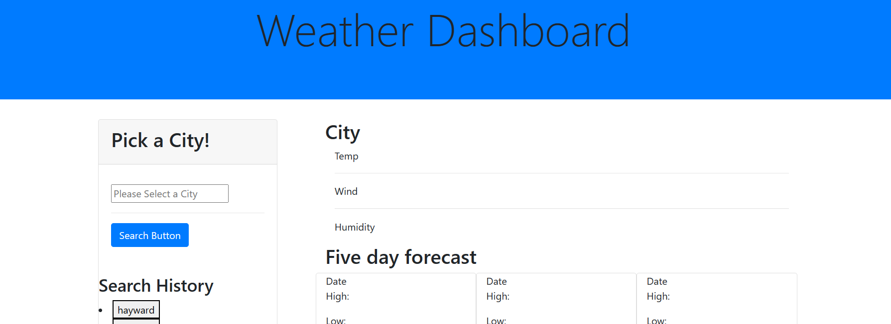

# DashboardWeather

# Weather-Dashboard

# Description

Javascript is used by programmers across the world to create dynamic and interactive web content like applications and browsers. JavaScript is so popular that it's the most used programming language in the world, used as a client-side programming language by 97.0% of all websites

The reason for building this specific project was the need for an application that displays the weather outlook for a selected city.

The OpenWeather API was used for retrieving the current day's temperature, humidity, wind speed, and uv index. It was also used to display the temperature and humidity for the following 5 days.

The Webpage can easily access through this link[https://akash2040.github.io/DashboardWeather/]

# Table of Content

1. [HomePage](#homepage)
2. [Features](#features)
3. [CodeSnippet](#codesnippet)
4. [Tools](#tools)
5. [Prerequisites](#prerequisites)
6. [AuthorLinks](#authorlinks)

# HomePage



# Features

- On first use the application will only display the Weather Dashboard header and a search field.
- Type in the name of the city for which you would like weather information.
- You will then see a display with the city name, current date, temp, humidity, wind speed, uv index, and an icon representing the weather conditions.

# CodeSnippet

```
function getWeatherInfo(cityname) {
  var Url =
    "https://api.openweathermap.org/data/2.5/weather?q=" +
    cityname +
    "&units=imperial&appid=7f056f2923c93db54124cd78a1bbb57b";
  fetch(
    // Make a fetch request using city
    Url
  )
    .then(function (response) {
      return response.json();
    })
    .then(function (response) {
      // Create variables to hold the latitude and longitude of requested city
      var currentIcon = response.weather[0].icon;
      var iconURl = "http://openweathermap.org/img/wn/" + currentIcon + ".png";
      console.log(iconURl);

      $(".Namecity").text(cityname);

      $(".Tempcurrent").text("Temperature: " + response.main.temp + " °F");
      $(".Windcurrent").text("Wind: " + response.wind.speed + " MPH");
      $(".currentHumidity").text("Humidity: " + response.main.humidity + " %");
      $("#Iconweather").attr({ src: iconURl, alt: "Current Weather Icon" });
      return fetch(
        "https://api.openweathermap.org/data/2.5/forecast?lat=" +
          latitude +
          "&lon=" +
          longitude +
          "&exclude=alerts,minutely,hourly&units=imperial&appid=f6740994883ab44d52a7d70b9244694d"
      );
    })
    .then(function (response) {
      // return response in json format
      return response.json();
    })
    .then(function (response) {
      console.log(response);
      // send response data to displayWeather function for final display
      // displayWeather(response);

      var iconDisplay = [];
      var iconsUrls = [];

      for (i = 1; i < 6; i++) {
        iconDisplay[i] = response.weather[0].icon;
      }

      iconDisplay = iconDisplay.filter((item) => item);
      for (i = 0; i < iconDisplay.length; i++) {
        iconsUrls[i] =
          "http://openweathermap.org/img/wn/" + iconDisplay[i] + ".png";
      }
      for (i = 0; i < iconsUrls.length; i++) {
        $("#icon" + i).attr({ src: iconsUrls[i], alt: "Daily Weather Icon" });
      }

```

# Tools

1. VsCode
2. Git (windows)
3. Github

# Prerequisites

Software need to be install

- Vscode
- git
- github(clone project)

# AuthorLinks

[Github](https://github.com/akash2040/DashboardWeather)
